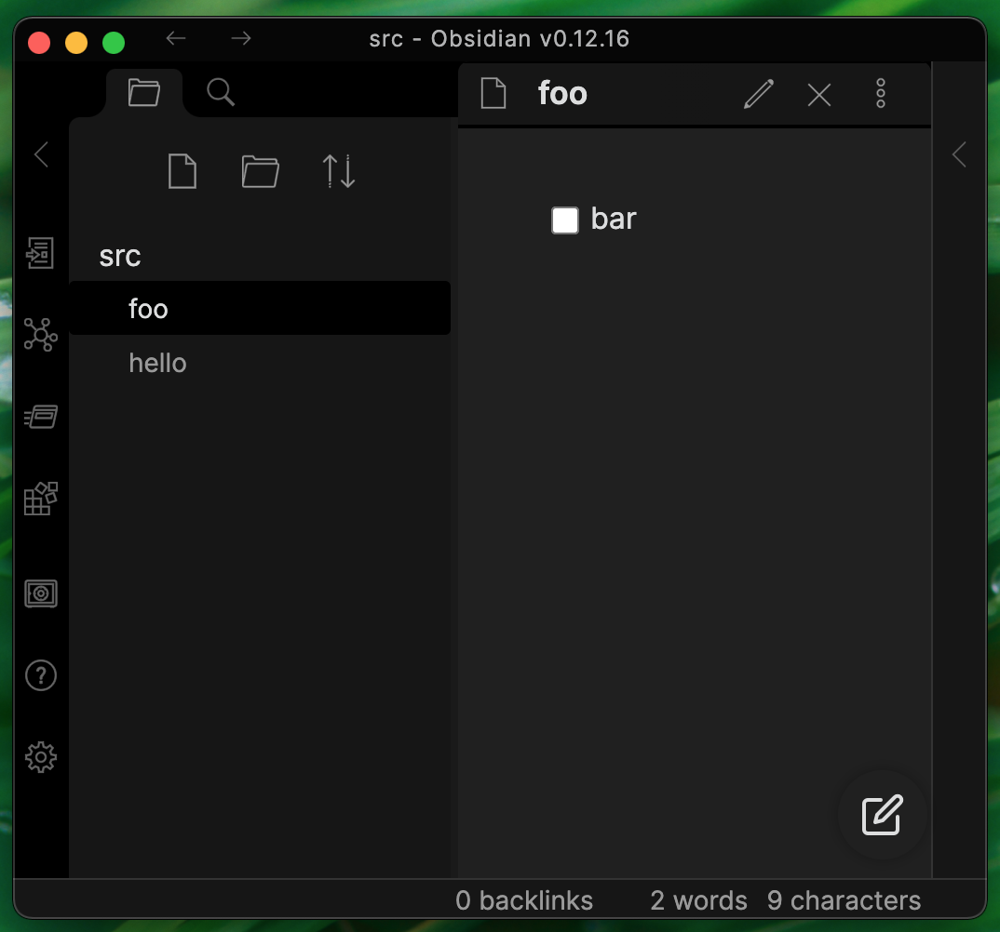
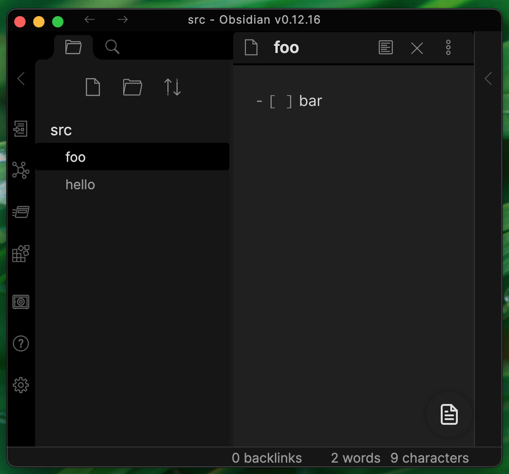

# Deprecated

This plugin has been deprecated. Instead, we recommend using CSS snippets or a theme.

- CSS snippet:
  - https://forum.obsidian.md/t/adding-floating-action-button-fab-for-your-mobile-using-css/61388/
- How to add your own CSS snippet:
  - https://help.obsidian.md/Extending+Obsidian/CSS+snippets
- Obsidian theme that supports FAB:
  - https://github.com/selfire1/obsidian-you-theme

## Obsidian Floating Action Button

An Obsidian plugin that displays a floating action button to switch between preview and edit modes.

**This plugin is still under development and is not yet available in the Obsidian plugin store.**

| Preview                        | Edit                     |
| ------------------------------ | ------------------------ |
|  |  |

### Releasing new releases

- Update your `manifest.json` with your new version number, such as `1.0.1`, and the minimum Obsidian version required for your latest release.
- Update your `versions.json` file with `"new-plugin-version": "minimum-obsidian-version"` so older versions of Obsidian can download an older version of your plugin that's compatible.
- Create new GitHub release using your new version number as the "Tag version". Use the exact version number, don't include a prefix `v`. See here for an example: https://github.com/obsidianmd/obsidian-sample-plugin/releases
- Upload the files `manifest.json`, `main.js`, `styles.css` as binary attachments.
- Publish the release.

### Adding your plugin to the community plugin list

- Publish an initial version.
- Make sure you have a `README.md` file in the root of your repo.
- Make a pull request at https://github.com/obsidianmd/obsidian-releases to add your plugin.

### How to use

- Clone this repo.
- `yarn` to install dependencies
- `yarn dev` to start compilation in watch mode.

### Manually installing the plugin

- Copy over `main.js`, `styles.css`, `manifest.json` to your vault `VaultFolder/.obsidian/plugins/your-plugin-id/`.

### API Documentation

See https://github.com/obsidianmd/obsidian-api

## Contributors

- @witecat
